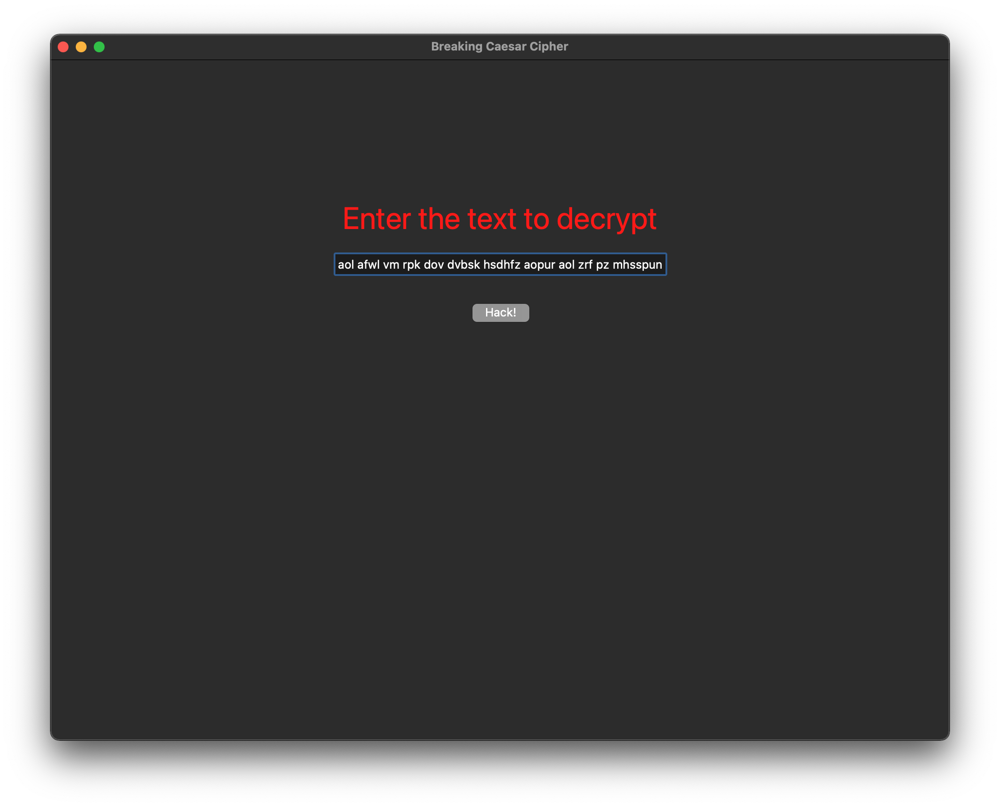
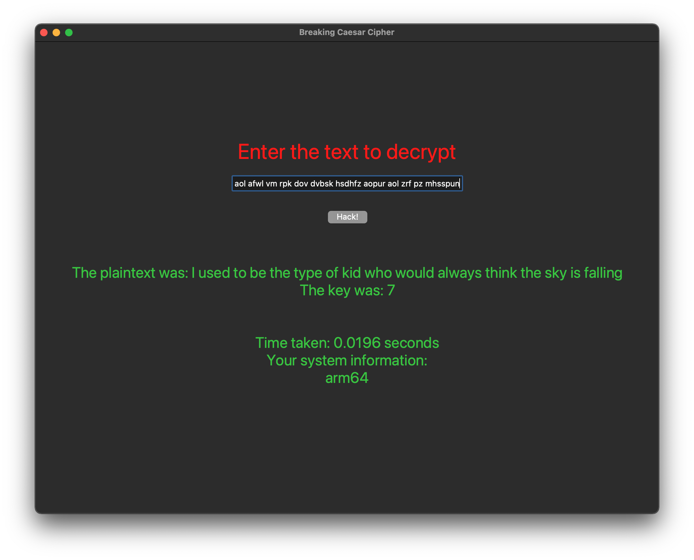

# Hacking-Caesar-Cipher
A brute-force approach to hacking the Caesar Cipher.

### More Info
This program provides a GUI to decrypt a given encrypted text using the Caesar Cipher Encryption.

It does not require a key as it uses a brute force approach to find it.

Currently supported language(s): English (US)

### How to run

Make sure you have Tkinter installed or install using:

```sh
pip install tk
```

Run the app using:
```sh
python3 main.py
```

### Example Usage

Enter the cipher text



Get the plain text and the key


